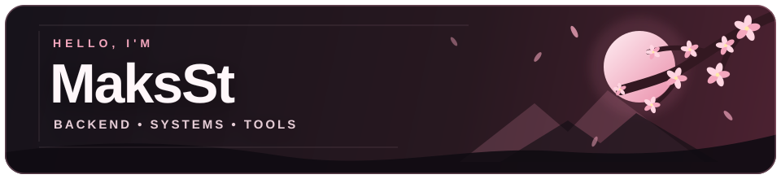
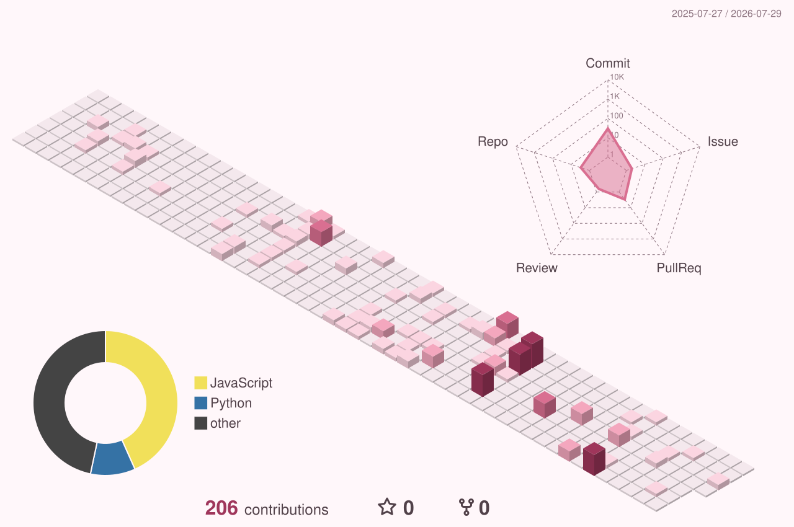

  

  <samp>⚙️ Backend &amp; Systems&nbsp;&nbsp;•&nbsp;&nbsp;🛠️ Tools&nbsp;&nbsp;•&nbsp;&nbsp;🌱 Always learning</samp>

  <h3>TOOLKIT</h3>

  

    
    
    
    
    
    
    
    
  

  <h3>ACTIVITY IN 3D</h3>

  

  Code blooms one line at a time.

